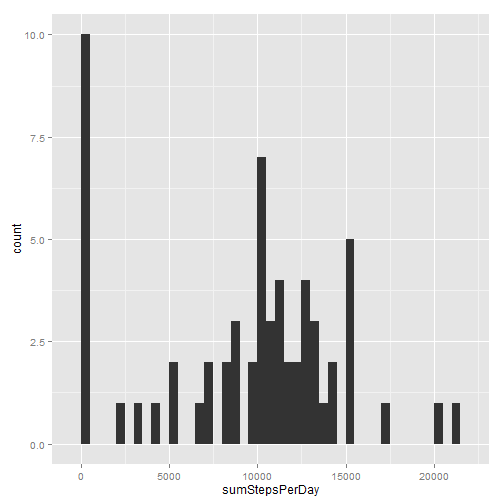
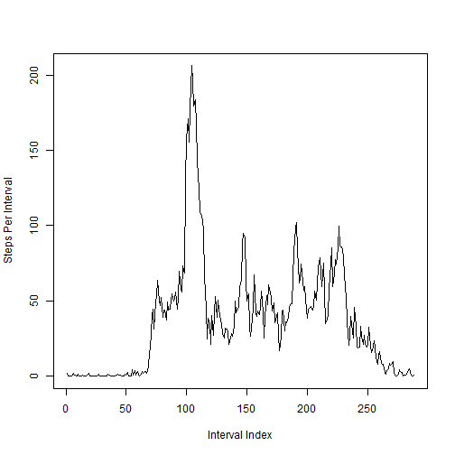
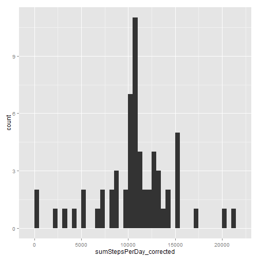
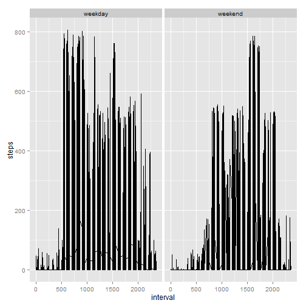

This is a report document to present the analysis of the activity data set provided within the Coursera "reproducible research" course, week 2.

We will use the ggplot2 system for this excercise as well as the lubridate package to cope with dates:


```r
library('ggplot2')
library('lubridate')
```

At first, we load the dataset. It is assumed that the data is available in the current working directory:


```r
activity_data<-read.csv('activity.csv')
```

The dataset summarizes as follows: 


```r
summary(activity_data)
```

```
##      steps                date          interval     
##  Min.   :  0.00   2012-10-01:  288   Min.   :   0.0  
##  1st Qu.:  0.00   2012-10-02:  288   1st Qu.: 588.8  
##  Median :  0.00   2012-10-03:  288   Median :1177.5  
##  Mean   : 37.38   2012-10-04:  288   Mean   :1177.5  
##  3rd Qu.: 12.00   2012-10-05:  288   3rd Qu.:1766.2  
##  Max.   :806.00   2012-10-06:  288   Max.   :2355.0  
##  NA's   :2304     (Other)   :15840
```

## What is mean total number of steps taken per day?
1. and 2.: We can directly calculate the total number of steps per day and plot the result in a histogram:


```r
sumStepsPerDay<-tapply(activity_data$steps,activity_data$date,sum,na.rm=TRUE)
sumStepsPerDay
```

```
## 2012-10-01 2012-10-02 2012-10-03 2012-10-04 2012-10-05 2012-10-06 
##          0        126      11352      12116      13294      15420 
## 2012-10-07 2012-10-08 2012-10-09 2012-10-10 2012-10-11 2012-10-12 
##      11015          0      12811       9900      10304      17382 
## 2012-10-13 2012-10-14 2012-10-15 2012-10-16 2012-10-17 2012-10-18 
##      12426      15098      10139      15084      13452      10056 
## 2012-10-19 2012-10-20 2012-10-21 2012-10-22 2012-10-23 2012-10-24 
##      11829      10395       8821      13460       8918       8355 
## 2012-10-25 2012-10-26 2012-10-27 2012-10-28 2012-10-29 2012-10-30 
##       2492       6778      10119      11458       5018       9819 
## 2012-10-31 2012-11-01 2012-11-02 2012-11-03 2012-11-04 2012-11-05 
##      15414          0      10600      10571          0      10439 
## 2012-11-06 2012-11-07 2012-11-08 2012-11-09 2012-11-10 2012-11-11 
##       8334      12883       3219          0          0      12608 
## 2012-11-12 2012-11-13 2012-11-14 2012-11-15 2012-11-16 2012-11-17 
##      10765       7336          0         41       5441      14339 
## 2012-11-18 2012-11-19 2012-11-20 2012-11-21 2012-11-22 2012-11-23 
##      15110       8841       4472      12787      20427      21194 
## 2012-11-24 2012-11-25 2012-11-26 2012-11-27 2012-11-28 2012-11-29 
##      14478      11834      11162      13646      10183       7047 
## 2012-11-30 
##          0
```

```r
qplot(sumStepsPerDay, binwidth = 500, geom="histogram") 
```

 

3.: We observe an accumulation of the step count per day just above 10000 steps. The corresponding mean and meadian od the steps taken per day are:


```r
meanStepsPerDay<-tapply(activity_data$steps,activity_data$date,mean,na.rm=TRUE)
medianStepsPerDay<-tapply(activity_data$steps,activity_data$date,median,na.rm=TRUE)
meanStepsPerDay
```

```
## 2012-10-01 2012-10-02 2012-10-03 2012-10-04 2012-10-05 2012-10-06 
##        NaN  0.4375000 39.4166667 42.0694444 46.1597222 53.5416667 
## 2012-10-07 2012-10-08 2012-10-09 2012-10-10 2012-10-11 2012-10-12 
## 38.2465278        NaN 44.4826389 34.3750000 35.7777778 60.3541667 
## 2012-10-13 2012-10-14 2012-10-15 2012-10-16 2012-10-17 2012-10-18 
## 43.1458333 52.4236111 35.2048611 52.3750000 46.7083333 34.9166667 
## 2012-10-19 2012-10-20 2012-10-21 2012-10-22 2012-10-23 2012-10-24 
## 41.0729167 36.0937500 30.6284722 46.7361111 30.9652778 29.0104167 
## 2012-10-25 2012-10-26 2012-10-27 2012-10-28 2012-10-29 2012-10-30 
##  8.6527778 23.5347222 35.1354167 39.7847222 17.4236111 34.0937500 
## 2012-10-31 2012-11-01 2012-11-02 2012-11-03 2012-11-04 2012-11-05 
## 53.5208333        NaN 36.8055556 36.7048611        NaN 36.2465278 
## 2012-11-06 2012-11-07 2012-11-08 2012-11-09 2012-11-10 2012-11-11 
## 28.9375000 44.7326389 11.1770833        NaN        NaN 43.7777778 
## 2012-11-12 2012-11-13 2012-11-14 2012-11-15 2012-11-16 2012-11-17 
## 37.3784722 25.4722222        NaN  0.1423611 18.8923611 49.7881944 
## 2012-11-18 2012-11-19 2012-11-20 2012-11-21 2012-11-22 2012-11-23 
## 52.4652778 30.6979167 15.5277778 44.3993056 70.9270833 73.5902778 
## 2012-11-24 2012-11-25 2012-11-26 2012-11-27 2012-11-28 2012-11-29 
## 50.2708333 41.0902778 38.7569444 47.3819444 35.3576389 24.4687500 
## 2012-11-30 
##        NaN
```

```r
medianStepsPerDay
```

```
## 2012-10-01 2012-10-02 2012-10-03 2012-10-04 2012-10-05 2012-10-06 
##         NA          0          0          0          0          0 
## 2012-10-07 2012-10-08 2012-10-09 2012-10-10 2012-10-11 2012-10-12 
##          0         NA          0          0          0          0 
## 2012-10-13 2012-10-14 2012-10-15 2012-10-16 2012-10-17 2012-10-18 
##          0          0          0          0          0          0 
## 2012-10-19 2012-10-20 2012-10-21 2012-10-22 2012-10-23 2012-10-24 
##          0          0          0          0          0          0 
## 2012-10-25 2012-10-26 2012-10-27 2012-10-28 2012-10-29 2012-10-30 
##          0          0          0          0          0          0 
## 2012-10-31 2012-11-01 2012-11-02 2012-11-03 2012-11-04 2012-11-05 
##          0         NA          0          0         NA          0 
## 2012-11-06 2012-11-07 2012-11-08 2012-11-09 2012-11-10 2012-11-11 
##          0          0          0         NA         NA          0 
## 2012-11-12 2012-11-13 2012-11-14 2012-11-15 2012-11-16 2012-11-17 
##          0          0         NA          0          0          0 
## 2012-11-18 2012-11-19 2012-11-20 2012-11-21 2012-11-22 2012-11-23 
##          0          0          0          0          0          0 
## 2012-11-24 2012-11-25 2012-11-26 2012-11-27 2012-11-28 2012-11-29 
##          0          0          0          0          0          0 
## 2012-11-30 
##         NA
```

```r
#---
meanStepsPerDayTotal<-mean(sumStepsPerDay)
medianStepsPerDayTotal<-median(sumStepsPerDay)
#output shown in text below
```

The mean of all the steps taken par day is meanStepsPerDayTotal=9354.2295082, the median medianStepsPerDayTotal=10395.

## What is the average daily activity pattern?

Let's take a look at the time series plot of the 5 minute intervals. First, we need to calculate the average steps per day across the intervals:


```r
stepsPerInterval<-tapply(activity_data$steps,activity_data$interval,mean,na.rm=TRUE)
stepsPerInterval
```

```
##           0           5          10          15          20          25 
##   1.7169811   0.3396226   0.1320755   0.1509434   0.0754717   2.0943396 
##          30          35          40          45          50          55 
##   0.5283019   0.8679245   0.0000000   1.4716981   0.3018868   0.1320755 
##         100         105         110         115         120         125 
##   0.3207547   0.6792453   0.1509434   0.3396226   0.0000000   1.1132075 
##         130         135         140         145         150         155 
##   1.8301887   0.1698113   0.1698113   0.3773585   0.2641509   0.0000000 
##         200         205         210         215         220         225 
##   0.0000000   0.0000000   1.1320755   0.0000000   0.0000000   0.1320755 
##         230         235         240         245         250         255 
##   0.0000000   0.2264151   0.0000000   0.0000000   1.5471698   0.9433962 
##         300         305         310         315         320         325 
##   0.0000000   0.0000000   0.0000000   0.0000000   0.2075472   0.6226415 
##         330         335         340         345         350         355 
##   1.6226415   0.5849057   0.4905660   0.0754717   0.0000000   0.0000000 
##         400         405         410         415         420         425 
##   1.1886792   0.9433962   2.5660377   0.0000000   0.3396226   0.3584906 
##         430         435         440         445         450         455 
##   4.1132075   0.6603774   3.4905660   0.8301887   3.1132075   1.1132075 
##         500         505         510         515         520         525 
##   0.0000000   1.5660377   3.0000000   2.2452830   3.3207547   2.9622642 
##         530         535         540         545         550         555 
##   2.0943396   6.0566038  16.0188679  18.3396226  39.4528302  44.4905660 
##         600         605         610         615         620         625 
##  31.4905660  49.2641509  53.7735849  63.4528302  49.9622642  47.0754717 
##         630         635         640         645         650         655 
##  52.1509434  39.3396226  44.0188679  44.1698113  37.3584906  49.0377358 
##         700         705         710         715         720         725 
##  43.8113208  44.3773585  50.5094340  54.5094340  49.9245283  50.9811321 
##         730         735         740         745         750         755 
##  55.6792453  44.3207547  52.2641509  69.5471698  57.8490566  56.1509434 
##         800         805         810         815         820         825 
##  73.3773585  68.2075472 129.4339623 157.5283019 171.1509434 155.3962264 
##         830         835         840         845         850         855 
## 177.3018868 206.1698113 195.9245283 179.5660377 183.3962264 167.0188679 
##         900         905         910         915         920         925 
## 143.4528302 124.0377358 109.1132075 108.1132075 103.7169811  95.9622642 
##         930         935         940         945         950         955 
##  66.2075472  45.2264151  24.7924528  38.7547170  34.9811321  21.0566038 
##        1000        1005        1010        1015        1020        1025 
##  40.5660377  26.9811321  42.4150943  52.6603774  38.9245283  50.7924528 
##        1030        1035        1040        1045        1050        1055 
##  44.2830189  37.4150943  34.6981132  28.3396226  25.0943396  31.9433962 
##        1100        1105        1110        1115        1120        1125 
##  31.3584906  29.6792453  21.3207547  25.5471698  28.3773585  26.4716981 
##        1130        1135        1140        1145        1150        1155 
##  33.4339623  49.9811321  42.0377358  44.6037736  46.0377358  59.1886792 
##        1200        1205        1210        1215        1220        1225 
##  63.8679245  87.6981132  94.8490566  92.7735849  63.3962264  50.1698113 
##        1230        1235        1240        1245        1250        1255 
##  54.4716981  32.4150943  26.5283019  37.7358491  45.0566038  67.2830189 
##        1300        1305        1310        1315        1320        1325 
##  42.3396226  39.8867925  43.2641509  40.9811321  46.2452830  56.4339623 
##        1330        1335        1340        1345        1350        1355 
##  42.7547170  25.1320755  39.9622642  53.5471698  47.3207547  60.8113208 
##        1400        1405        1410        1415        1420        1425 
##  55.7547170  51.9622642  43.5849057  48.6981132  35.4716981  37.5471698 
##        1430        1435        1440        1445        1450        1455 
##  41.8490566  27.5094340  17.1132075  26.0754717  43.6226415  43.7735849 
##        1500        1505        1510        1515        1520        1525 
##  30.0188679  36.0754717  35.4905660  38.8490566  45.9622642  47.7547170 
##        1530        1535        1540        1545        1550        1555 
##  48.1320755  65.3207547  82.9056604  98.6603774 102.1132075  83.9622642 
##        1600        1605        1610        1615        1620        1625 
##  62.1320755  64.1320755  74.5471698  63.1698113  56.9056604  59.7735849 
##        1630        1635        1640        1645        1650        1655 
##  43.8679245  38.5660377  44.6603774  45.4528302  46.2075472  43.6792453 
##        1700        1705        1710        1715        1720        1725 
##  46.6226415  56.3018868  50.7169811  61.2264151  72.7169811  78.9433962 
##        1730        1735        1740        1745        1750        1755 
##  68.9433962  59.6603774  75.0943396  56.5094340  34.7735849  37.4528302 
##        1800        1805        1810        1815        1820        1825 
##  40.6792453  58.0188679  74.6981132  85.3207547  59.2641509  67.7735849 
##        1830        1835        1840        1845        1850        1855 
##  77.6981132  74.2452830  85.3396226  99.4528302  86.5849057  85.6037736 
##        1900        1905        1910        1915        1920        1925 
##  84.8679245  77.8301887  58.0377358  53.3584906  36.3207547  20.7169811 
##        1930        1935        1940        1945        1950        1955 
##  27.3962264  40.0188679  30.2075472  25.5471698  45.6603774  33.5283019 
##        2000        2005        2010        2015        2020        2025 
##  19.6226415  19.0188679  19.3396226  33.3396226  26.8113208  21.1698113 
##        2030        2035        2040        2045        2050        2055 
##  27.3018868  21.3396226  19.5471698  21.3207547  32.3018868  20.1509434 
##        2100        2105        2110        2115        2120        2125 
##  15.9433962  17.2264151  23.4528302  19.2452830  12.4528302   8.0188679 
##        2130        2135        2140        2145        2150        2155 
##  14.6603774  16.3018868   8.6792453   7.7924528   8.1320755   2.6226415 
##        2200        2205        2210        2215        2220        2225 
##   1.4528302   3.6792453   4.8113208   8.5094340   7.0754717   8.6981132 
##        2230        2235        2240        2245        2250        2255 
##   9.7547170   2.2075472   0.3207547   0.1132075   1.6037736   4.6037736 
##        2300        2305        2310        2315        2320        2325 
##   3.3018868   2.8490566   0.0000000   0.8301887   0.9622642   1.5849057 
##        2330        2335        2340        2345        2350        2355 
##   2.6037736   4.6981132   3.3018868   0.6415094   0.2264151   1.0754717
```

1.: The plot of stepsPerInterval looks as follows:


```r
plot(stepsPerInterval, type='l',xlab="Interval Index",ylab="Steps Per Interval")
```

 

```r
MAX<-max(stepsPerInterval)
whichMax<-which.max(stepsPerInterval)
#output shown in text below
```

Note that the NA values have been removed in the above plot representation. 
2.: The 104th interval contains the maximum averaged steps per day of 206.1698113 steps.

## Imputing missing values

1.: The count of missing values in the steps column is:


```r
sum(is.na(activity_data$steps))
```

```
## [1] 2304
```

2./3.: We can now replace the na values in the step column with the calculated mean value for the respective interval. If the value is still NaN, we insert a zero. The new dataset containing the missing data filled in following the mentioned strategy is saved in activity_data_corrected:


```r
#create copy of original dataset
activity_data_corrected<-activity_data

meanStepsPerInterval<-aggregate(activity_data$steps,list(activity_data$interval),mean,na.rm=TRUE)
rownames(meanStepsPerInterval)<-meanStepsPerInterval$Group.1

#replace values
i=0
for (i in 1:nrow(activity_data)){
  if(is.na(activity_data$steps[i])){
    activity_data_corrected$steps[i] <- subset(meanStepsPerInterval, Group.1 == activity_data[i,3],select=c(x))[[1]]
    }
}

head(activity_data,25)
```

```
##    steps       date interval
## 1     NA 2012-10-01        0
## 2     NA 2012-10-01        5
## 3     NA 2012-10-01       10
## 4     NA 2012-10-01       15
## 5     NA 2012-10-01       20
## 6     NA 2012-10-01       25
## 7     NA 2012-10-01       30
## 8     NA 2012-10-01       35
## 9     NA 2012-10-01       40
## 10    NA 2012-10-01       45
## 11    NA 2012-10-01       50
## 12    NA 2012-10-01       55
## 13    NA 2012-10-01      100
## 14    NA 2012-10-01      105
## 15    NA 2012-10-01      110
## 16    NA 2012-10-01      115
## 17    NA 2012-10-01      120
## 18    NA 2012-10-01      125
## 19    NA 2012-10-01      130
## 20    NA 2012-10-01      135
## 21    NA 2012-10-01      140
## 22    NA 2012-10-01      145
## 23    NA 2012-10-01      150
## 24    NA 2012-10-01      155
## 25    NA 2012-10-01      200
```

```r
head(activity_data_corrected,25)
```

```
##        steps       date interval
## 1  1.7169811 2012-10-01        0
## 2  0.3396226 2012-10-01        5
## 3  0.1320755 2012-10-01       10
## 4  0.1509434 2012-10-01       15
## 5  0.0754717 2012-10-01       20
## 6  2.0943396 2012-10-01       25
## 7  0.5283019 2012-10-01       30
## 8  0.8679245 2012-10-01       35
## 9  0.0000000 2012-10-01       40
## 10 1.4716981 2012-10-01       45
## 11 0.3018868 2012-10-01       50
## 12 0.1320755 2012-10-01       55
## 13 0.3207547 2012-10-01      100
## 14 0.6792453 2012-10-01      105
## 15 0.1509434 2012-10-01      110
## 16 0.3396226 2012-10-01      115
## 17 0.0000000 2012-10-01      120
## 18 1.1132075 2012-10-01      125
## 19 1.8301887 2012-10-01      130
## 20 0.1698113 2012-10-01      135
## 21 0.1698113 2012-10-01      140
## 22 0.3773585 2012-10-01      145
## 23 0.2641509 2012-10-01      150
## 24 0.0000000 2012-10-01      155
## 25 0.0000000 2012-10-01      200
```

4.: The histogram now looks like:


```r
sumStepsPerDay_corrected<-tapply(activity_data_corrected$steps,activity_data_corrected$date,sum,na.rm=FALSE)
qplot(sumStepsPerDay_corrected, binwidth = 500, geom="histogram") 
```

 

```r
sumStepsPerDay_corrected
```

```
## 2012-10-01 2012-10-02 2012-10-03 2012-10-04 2012-10-05 2012-10-06 
##   10766.19     126.00   11352.00   12116.00   13294.00   15420.00 
## 2012-10-07 2012-10-08 2012-10-09 2012-10-10 2012-10-11 2012-10-12 
##   11015.00   10766.19   12811.00    9900.00   10304.00   17382.00 
## 2012-10-13 2012-10-14 2012-10-15 2012-10-16 2012-10-17 2012-10-18 
##   12426.00   15098.00   10139.00   15084.00   13452.00   10056.00 
## 2012-10-19 2012-10-20 2012-10-21 2012-10-22 2012-10-23 2012-10-24 
##   11829.00   10395.00    8821.00   13460.00    8918.00    8355.00 
## 2012-10-25 2012-10-26 2012-10-27 2012-10-28 2012-10-29 2012-10-30 
##    2492.00    6778.00   10119.00   11458.00    5018.00    9819.00 
## 2012-10-31 2012-11-01 2012-11-02 2012-11-03 2012-11-04 2012-11-05 
##   15414.00   10766.19   10600.00   10571.00   10766.19   10439.00 
## 2012-11-06 2012-11-07 2012-11-08 2012-11-09 2012-11-10 2012-11-11 
##    8334.00   12883.00    3219.00   10766.19   10766.19   12608.00 
## 2012-11-12 2012-11-13 2012-11-14 2012-11-15 2012-11-16 2012-11-17 
##   10765.00    7336.00   10766.19      41.00    5441.00   14339.00 
## 2012-11-18 2012-11-19 2012-11-20 2012-11-21 2012-11-22 2012-11-23 
##   15110.00    8841.00    4472.00   12787.00   20427.00   21194.00 
## 2012-11-24 2012-11-25 2012-11-26 2012-11-27 2012-11-28 2012-11-29 
##   14478.00   11834.00   11162.00   13646.00   10183.00    7047.00 
## 2012-11-30 
##   10766.19
```

```r
sumStepsPerDay
```

```
## 2012-10-01 2012-10-02 2012-10-03 2012-10-04 2012-10-05 2012-10-06 
##          0        126      11352      12116      13294      15420 
## 2012-10-07 2012-10-08 2012-10-09 2012-10-10 2012-10-11 2012-10-12 
##      11015          0      12811       9900      10304      17382 
## 2012-10-13 2012-10-14 2012-10-15 2012-10-16 2012-10-17 2012-10-18 
##      12426      15098      10139      15084      13452      10056 
## 2012-10-19 2012-10-20 2012-10-21 2012-10-22 2012-10-23 2012-10-24 
##      11829      10395       8821      13460       8918       8355 
## 2012-10-25 2012-10-26 2012-10-27 2012-10-28 2012-10-29 2012-10-30 
##       2492       6778      10119      11458       5018       9819 
## 2012-10-31 2012-11-01 2012-11-02 2012-11-03 2012-11-04 2012-11-05 
##      15414          0      10600      10571          0      10439 
## 2012-11-06 2012-11-07 2012-11-08 2012-11-09 2012-11-10 2012-11-11 
##       8334      12883       3219          0          0      12608 
## 2012-11-12 2012-11-13 2012-11-14 2012-11-15 2012-11-16 2012-11-17 
##      10765       7336          0         41       5441      14339 
## 2012-11-18 2012-11-19 2012-11-20 2012-11-21 2012-11-22 2012-11-23 
##      15110       8841       4472      12787      20427      21194 
## 2012-11-24 2012-11-25 2012-11-26 2012-11-27 2012-11-28 2012-11-29 
##      14478      11834      11162      13646      10183       7047 
## 2012-11-30 
##          0
```

```r
meanStepsPerDay_corrected<-tapply(activity_data_corrected$steps,activity_data_corrected$date,mean,na.rm=FALSE)
medianStepsPerDay_corrected<-tapply(activity_data_corrected$steps,activity_data_corrected$date,median,na.rm=FALSE)
meanStepsPerDay_corrected
```

```
## 2012-10-01 2012-10-02 2012-10-03 2012-10-04 2012-10-05 2012-10-06 
## 37.3825996  0.4375000 39.4166667 42.0694444 46.1597222 53.5416667 
## 2012-10-07 2012-10-08 2012-10-09 2012-10-10 2012-10-11 2012-10-12 
## 38.2465278 37.3825996 44.4826389 34.3750000 35.7777778 60.3541667 
## 2012-10-13 2012-10-14 2012-10-15 2012-10-16 2012-10-17 2012-10-18 
## 43.1458333 52.4236111 35.2048611 52.3750000 46.7083333 34.9166667 
## 2012-10-19 2012-10-20 2012-10-21 2012-10-22 2012-10-23 2012-10-24 
## 41.0729167 36.0937500 30.6284722 46.7361111 30.9652778 29.0104167 
## 2012-10-25 2012-10-26 2012-10-27 2012-10-28 2012-10-29 2012-10-30 
##  8.6527778 23.5347222 35.1354167 39.7847222 17.4236111 34.0937500 
## 2012-10-31 2012-11-01 2012-11-02 2012-11-03 2012-11-04 2012-11-05 
## 53.5208333 37.3825996 36.8055556 36.7048611 37.3825996 36.2465278 
## 2012-11-06 2012-11-07 2012-11-08 2012-11-09 2012-11-10 2012-11-11 
## 28.9375000 44.7326389 11.1770833 37.3825996 37.3825996 43.7777778 
## 2012-11-12 2012-11-13 2012-11-14 2012-11-15 2012-11-16 2012-11-17 
## 37.3784722 25.4722222 37.3825996  0.1423611 18.8923611 49.7881944 
## 2012-11-18 2012-11-19 2012-11-20 2012-11-21 2012-11-22 2012-11-23 
## 52.4652778 30.6979167 15.5277778 44.3993056 70.9270833 73.5902778 
## 2012-11-24 2012-11-25 2012-11-26 2012-11-27 2012-11-28 2012-11-29 
## 50.2708333 41.0902778 38.7569444 47.3819444 35.3576389 24.4687500 
## 2012-11-30 
## 37.3825996
```

```r
medianStepsPerDay_corrected
```

```
## 2012-10-01 2012-10-02 2012-10-03 2012-10-04 2012-10-05 2012-10-06 
##   34.11321    0.00000    0.00000    0.00000    0.00000    0.00000 
## 2012-10-07 2012-10-08 2012-10-09 2012-10-10 2012-10-11 2012-10-12 
##    0.00000   34.11321    0.00000    0.00000    0.00000    0.00000 
## 2012-10-13 2012-10-14 2012-10-15 2012-10-16 2012-10-17 2012-10-18 
##    0.00000    0.00000    0.00000    0.00000    0.00000    0.00000 
## 2012-10-19 2012-10-20 2012-10-21 2012-10-22 2012-10-23 2012-10-24 
##    0.00000    0.00000    0.00000    0.00000    0.00000    0.00000 
## 2012-10-25 2012-10-26 2012-10-27 2012-10-28 2012-10-29 2012-10-30 
##    0.00000    0.00000    0.00000    0.00000    0.00000    0.00000 
## 2012-10-31 2012-11-01 2012-11-02 2012-11-03 2012-11-04 2012-11-05 
##    0.00000   34.11321    0.00000    0.00000   34.11321    0.00000 
## 2012-11-06 2012-11-07 2012-11-08 2012-11-09 2012-11-10 2012-11-11 
##    0.00000    0.00000    0.00000   34.11321   34.11321    0.00000 
## 2012-11-12 2012-11-13 2012-11-14 2012-11-15 2012-11-16 2012-11-17 
##    0.00000    0.00000   34.11321    0.00000    0.00000    0.00000 
## 2012-11-18 2012-11-19 2012-11-20 2012-11-21 2012-11-22 2012-11-23 
##    0.00000    0.00000    0.00000    0.00000    0.00000    0.00000 
## 2012-11-24 2012-11-25 2012-11-26 2012-11-27 2012-11-28 2012-11-29 
##    0.00000    0.00000    0.00000    0.00000    0.00000    0.00000 
## 2012-11-30 
##   34.11321
```

The mean values for the non-NA cases do not differ from those obtained without the corrections. Of course, the now corrected datasets show the identical value corresponding to the ideal set of averaged data. The mean values now contain data different from zero as the averaged dataset does not contain a single zero within its range. Therefore, the median must be greater than zero.

##Are there differences in activity patterns between weekdays and weekends?

1.: The factor $typeDay contains the information, if we're dealing with a weekday or a weekend-day:


```r
activity_data_corrected$typeDay <- ifelse(wday(as.Date(activity_data_corrected$date))>1 & wday(as.Date(activity_data_corrected$date))<7 ,"weekday", "weekend")
head(activity_data_corrected$typeDay)
```

```
## [1] "weekday" "weekday" "weekday" "weekday" "weekday" "weekday"
```

2.: The results are displayed in the panel plot below.


```r
ggplot(activity_data_corrected, aes(x=interval,y=steps))+geom_line()+facet_grid(.~typeDay)
```

 

On weekdays, we see larger amount of performed steps during the early intervals per day, i.e. between interval 500 and 1000, compared to weekends. A possible interpretation might be, that people start their days later on weekends on average.
